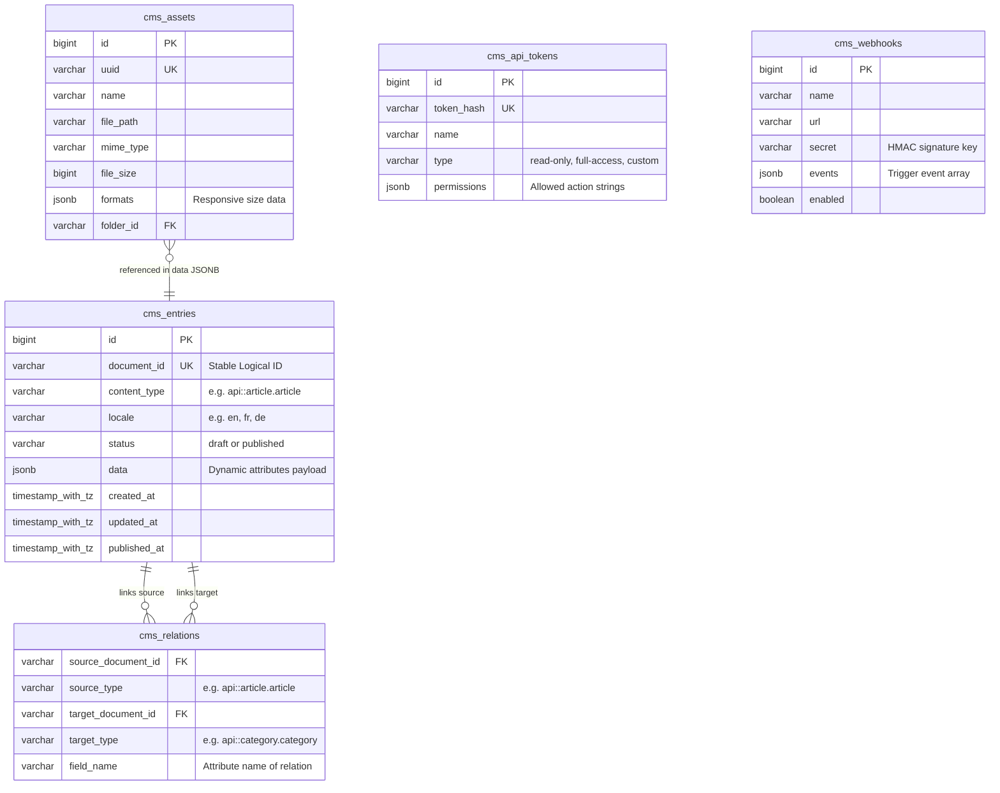

# Quarkus Headless CMS - Architecture Documentation

This document describes the design patterns, data models, module structures, and request lifecycles of the Quarkus Headless CMS.

---

## 1. Modular Sub-Module Architecture

The system is designed as a modular parent aggregator Maven project. By packaging distinct functionalities into isolated sub-modules, we prevent dependency bloat and guarantee that core libraries are light enough to compile to static GraalVM native binaries.

```
                      +-----------------------------------+
                      |   quarkus-headless-cms (Parent)   |
                      +-----------------+-----------------+
                                        |
       +-----------------------+--------+--------+------------------------+
       |                       |                 |                        |
       v                       v                 v                        v
+------------+          +------------+    +------------+           +------------+
|  cms-core  |          |cms-rest-api|    |  cms-auth  |           | cms-media  |
|  (Schemas, |          | (REST      |    |  (RBAC,    |           |  (Uploads, |
|  JSONB)    |          |  Queries)  |    |   Tokens)  |           |  Storage)  |
+------------+          +------------+    +------------+           +------------+
       |                       |                 |                        |
       +-----------------------+--------+--------+------------------------+
                                        |
                                        v
                               +-----------------+
                               |     runtime     |
                               +--------+--------+
                                        |
                                        v
                               +-----------------+
                               |   deployment    |
                               +-----------------+
```

### Module Responsibilities

| Module | Responsibility | Key Technologies |
|---|---|---|
| `cms-core` | Schema parsing, database entities, validation, in-memory registry. | Jackson, Hibernate, networknt schema validator |
| `cms-rest-api` | Client content endpoints, dynamic LHS bracket query parser, SQL translation. | RESTEasy Reactive, CmsQueryBuilder |
| `cms-admin-api`| JAX-RS routes serving the administrative UI. | RESTEasy, Jackson |
| `cms-admin-ui` | Sidebar templates, forms, drag-and-drop lists, and HTMX configurations. | Quarkus Qute, HTMX, Tailwind CSS |
| `cms-auth` | User accounts, credentials, JWT signature keys, dynamic client API Tokens. | SmallRye JWT, bcrypt |
| `cms-media` | File upload streams, mime-type verification, image resizing, S3 integrations. | Apache Tika, Thumbnailator, AWS S3 Client |
| `cms-i18n` | Multi-locale registries, i18n CRUD endpoints, Accept-Language fallbacks. | CmsLocale, LocaleService |
| `cms-graphql` | Dynamic in-memory schema builder, queries, mutations, type mappings. | SmallRye GraphQL, GraphQLContentService |
| `cms-webhooks` | Asynchronous callbacks, payload serialization, HMAC verification. | Vert.x Web Client, LifecycleEventBus |
| `cms-plugin` | Plugin SPI, plugin discovery, sandboxed ClassLoader, SEO Example plugin. | ServiceLoader, PluginClassLoader |
| `runtime` | CDI bean bootstrap recorders, feature integrations, properties bindings. | Quarkus Runtime extension |
| `deployment` | Build-time bytecode inspection, Jandex indexing, native reflection mapping. | Quarkus Deployment build-step processor |

---

## 2. Key Design Decisions

To match the modeling flexibility of Node.js-based CMS solutions like Strapi while delivering the performance and compilation efficiency of Quarkus and GraalVM, several foundational architectural choices were made.

### 2.1 Hybrid Document-on-RDBMS Storage
Java is statically typed. Standard JPA entities represent physical relational columns mapping to physical database schemas. Creating database tables dynamically on the fly during runtime is incompatible with GraalVM Native compilation because Hibernate requires metadata about all entity classes to be analyzed and locked in at build time.

**Our Solution**: The database schema is static and managed via Flyway. Standard, indexing, and auditing attributes are stored as traditional relational columns. Custom, user-defined fields are serialized into a single PostgreSQL `JSONB` column named `data`.

### 2.2 Stable Document-ID Binding (i18n & Draft Isolation)
To support multi-locale content and draft-publish staging simultaneously without multiplying tables:
- A single conceptual entry is assigned a stable logical identifier called `documentId` (e.g., `art_z1x2y3w4`).
- Draft versions and published versions are stored as separate rows in `cms_entries`. The draft has `status = 'draft'` and the published row has `status = 'published'`.
- Localized translations are stored as separate rows sharing the same `documentId` but with differing `locale` codes (e.g., `en`, `fr`, `es`).

This eliminates complex table self-joins or versioning history schemas, and matches the architectural concepts introduced in **Strapi v5**.

### 2.3 Polymorphic Relation Adjacency List
Traditional relational modeling uses direct foreign keys or join tables (e.g., `article_categories_links`). 
Because tables cannot be added or altered dynamically, relation links are decoupled into a dedicated, indexed adjacency-list table called `cms_relations`.

---

## 3. Data Model Diagram (Mermaid)

The following diagram illustrates the relationship between the core tables of the headless CMS:



---

## 4. Request Lifecycle Flow

Understanding how a request traverses the Quarkus reactive stack is essential for extending the CMS or debugging performance.

### 4.1 Client Content Read Request Flow (`GET /api/articles?filters[title][$contains]=Quarkus`)

1. **JAX-RS Route Discovery**: 
   - RESTEasy Reactive identifies the dynamic route `/api/{contentType}`.
2. **Authentication / Security Check**:
   - `CmsApiTokenFilter` intercepts the request, reads the HTTP `Authorization: Bearer <token>` header, hashes the token, and queries the `cms_api_tokens` cache.
   - If valid, the security context is augmented with the permissions mapped to that token via `CmsSecurityIdentityAugmentor`.
   - The permission interceptor verifies that the augmented identity possesses the `api::article.article.findMany` action. If not, throws an HTTP `403 Forbidden`.
3. **Dynamic Query Parsing**:
   - The REST layer passes the query parameters map to `CmsQueryBuilder`.
   - `CmsQueryBuilder` parses LHS brackets (e.g. `filters[title][$contains]=Quarkus`) and converts them into standard PostgreSQL JSONB query structures using native JPA criteria parameters.
4. **Service Execution**:
   - `CmsDocumentService` loads the `Article` schema from `CmsSchemaRegistry` to verify fields.
   - It queries `cms_entries` filtered by `content_type = 'api::article.article'`, `status = 'published'` (the default for API), and the compiled JSONB criteria.
5. **Relation Loading (DataLoader/Batching)**:
   - If relationships are requested, the `CmsRelationService` batch-loads related document IDs from `cms_relations` to prevent `N+1` query scenarios.
6. **Response Marshalling**:
   - Jackson serializes the list of entities into the standard Strapi-compatible JSON envelope containing `"data"` and `"meta"` paginated sections.

### 4.2 Content Writing Request Flow (`POST /api/articles` with JSON payload)

```
[HTTP POST] -> [Auth Filter] -> [Schema Validation] -> [Before-Hooks (CDI Sync)] -> [DB Write (Hibernate)] -> [After-Hooks (CDI Async)] -> [Webhook Dispatch (Vert.x)] -> [HTTP 201]
```

1. **Auth & Authorization**: Same as the read flow, checking for the `api::article.article.create` permission.
2. **Schema Validation**:
   - The raw JSON payload inside `"data"` is interceptor-validated by `SchemaValidator` against the networknt JSON Schema for the `Article` content type.
   - If validations fail (e.g., missing required field `slug`, or title is longer than 150 chars), the system aborts immediately with a `400 Bad Request` and returns validation error details.
3. **CDI Synchronous Before-Hooks**:
   - The transaction begins.
   - `CmsDocumentService` fires a CDI synchronous `beforeCreate` `LifecycleEvent`.
   - All observers (such as automated slug-generators or SEO meta-generation hooks) execute sequentially within the transaction. They can modify the incoming payload or abort the transaction by throwing an exception.
4. **Database Persistence**:
   - The `CmsEntry` record is saved as a `draft` status row.
   - Direct relations are created in `cms_relations`.
   - The database transaction commits.
5. **CDI Asynchronous After-Hooks**:
   - `CmsDocumentService` fires a CDI asynchronous `afterCreate` event (`@ObservesAsync`).
   - Long-running hooks (e.g., notifying search indexes, clearing cache, mailing authors) run in background worker threads without blocking the HTTP response.
6. **Webhook Dispatch**:
   - A `WebhookEventConsumer` intercepts the after-event and places it on the Vert.x Event Bus address `cms.lifecycle.create.after`.
   - The `WebhookDispatcher` picks up the event, constructs the standardized payload, signs it using HMAC-SHA256, and dispatches it asynchronously using non-blocking Vert.x Web Clients.
7. **HTTP Response**:
   - The client receives an HTTP `201 Created` with the newly generated `documentId` and full saved state.
